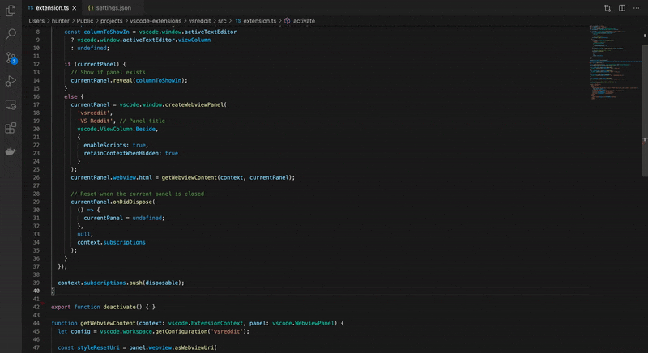

# VS Reddit

Easily search Reddit from VS Code



## Features

- Quickly search posts on Reddit.com
- Sort posts by relevance or date posted
- Light and dark modes
### Todo/in progress:
- Browse by subreddit
- View post/comment detailed preview

> If you're interested in more features, feel free to open an issue on the repository.

## Usage

1. Open command palete: `cmd+shift+p`
2. Enter `VS Reddit`

### Enable Dark Mode

In your settings.json, set the darkMode variable:
```json
{
  "vsreddit.darkMode": true
}
```

## Release Notes

### 1.0.1

Added post preview
- Now view images, gifs, links, and text in the posts

### 1.0.0

Initial release
